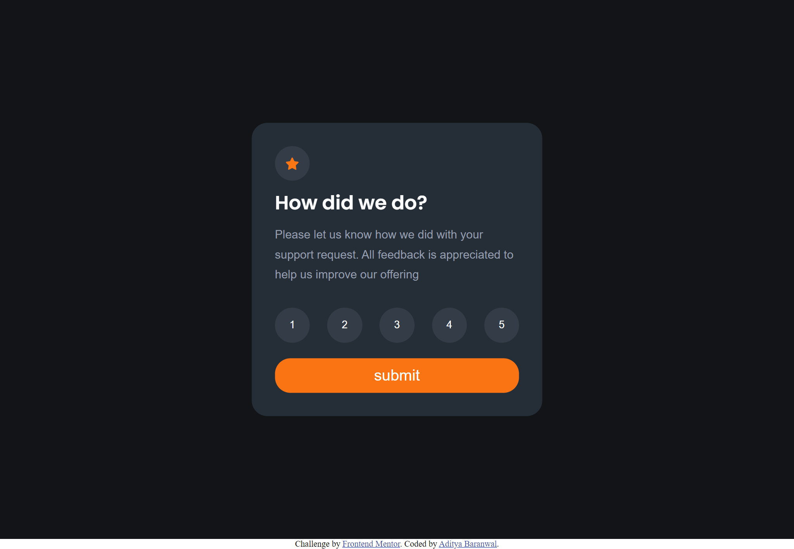

# Frontend Mentor - Interactive rating component solution

This is a solution to the [Interactive rating component challenge on Frontend Mentor](https://www.frontendmentor.io/challenges/interactive-rating-component-koxpeBUmI). Frontend Mentor challenges help you improve your coding skills by building realistic projects. 

## Table of contents

- [Overview](#overview)
  - [The challenge](#the-challenge)
  - [Screenshot](#screenshot)
  - [Links](#links)
- [My process](#my-process)
  - [Built with](#built-with)
  - [What I learned](#what-i-learned)
  - [Continued development](#continued-development)
  - [Useful resources](#useful-resources)
- [Author](#author)
- [Acknowledgments](#acknowledgments)

**Note: Delete this note and update the table of contents based on what sections you keep.**

## Overview

### The challenge

Users should be able to:

- View the optimal layout for the app depending on their device's screen size
- See hover states for all interactive elements on the page
- Select and submit a number rating
- See the "Thank you" card state after submitting a rating

### Screenshot

.png)
.png)


### Links

- Solution URL: [https://github.com/CHARLIEADITYA/huddle-landing-page.git]
- Live Site URL: [https://charlieaditya.github.io/huddle-landing-page/]

## My process

### Built with

- Semantic HTML5 markup
- CSS custom properties
- Flexbox
- Mobile-first workflow


### What I learned
Here I learned a javascript 

To see how you can add code snippets, see below:

```
```js
function myFunction() {
  const p = document.querySelector(".component");
  p.classList.add("hide");
  document.querySelector(".content").classList.remove("hide");
}
window.addEventListener("load", () => {
  document.querySelectorAll(".rating").forEach((element) => {
    element.addEventListener("click", () => {
      document.querySelector(".rate").innerHTML = element.innerHTML;
    });
  });
});
```

### Continued development

Use this section to outline areas that you want to continue focusing on in future projects. These could be concepts you're still not completely comfortable with or techniques you found useful that you want to refine and perfect.


## Author

- Website - [Aditya Baranwal]
- Frontend Mentor - [@CHARLIEADITYA](https://www.frontendmentor.io/home)
- Linkdin - [aditya-baranwal](https://www.linkedin.com/in/aditya-baranwal-805978224/)


